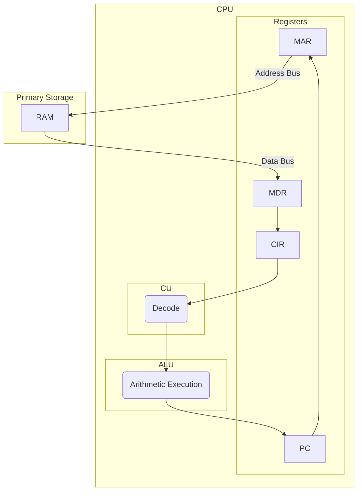

## 1.1 Hardware
 - Input
   - Any device that can convert analogue information from people to digital information for computers.
   - Keyboards
   - Microphones
   - Webcams
   - Cameras
   - Scanners
 - Output
   - Any device that can take digital information and produce it in analogue, human-readable format.
   - Monitors
   - Speakers
   - Headphones
   - Printers
     - Laser – Uses lasers and magnetic toner, Inkjet – Uses jets of ink, Plotter – Uses maths and a physical pen
 - Storage
   - Secondary
     - SSD/HDD
     - Magnetic Tape
     - Optical
     - USB/MicroSD
   - Primary
     - RAM – Random access memory
     - ROM – Read only memory
     - Cache Memory, L1-3
 - Accessibility
   - Input
     - Braille keyboard
     - Puff-Suck switch
     - Trackball
   - Output
     - Braille display
     - Screen-readers
     - Voice Recognition
       - Voice Recognition 	– Commands
       - Voice Dictation	– Typing
       - Voice Print		– Authentication
 - Touchscreens
   - Resistive		– Uses a softer, flexible sheet of plastic to physically force electrodes to touch
   - Infrared		– Uses blocked beams of IR to detect when and where it was touched
   - Capacitive		– Uses the natural electric current in the human body to detect touch.

## 1.2 Von-Neumann Architecture
The von Neumann architecture—also known as the von Neumann model or Princeton architecture—is a computer architecture based on a 1945 description by John von Neumann. It consists of the following:
> [!tip]- Main Memory
> RAM – Random access memory, volatile, read/write storage
> ROM – Read only memory, non-volatile, read only storage
> Data and instructions are held in the same space
> CPU – Central processing unit

> [!tip]- Data Busses
> Address Bus – One way, carries the address requested by components.
> Data Bus – Two way, carries data between processor and storage devices.
> Control Bus – Two way, commands, timing and I/O information.

> [!tip]- Registers
> Program Counter
> Current Instruction Register
> Accumulator
> Memory Address Register
> Memory Data Register

> [!tip]- Other Components
> Arithmetic Logic Unit
> Control Unit
> Cache Memory

Factors of a CPU
 - Cache Size – b
 - Clock Speed – hz
 - Core Count – (number)
 - Word Size – bits that can be processed simultaneously
 - Bus Size – bits that can be transferred together.

## 1.3 FDE Cycle

## 1.8 The Operating System.

