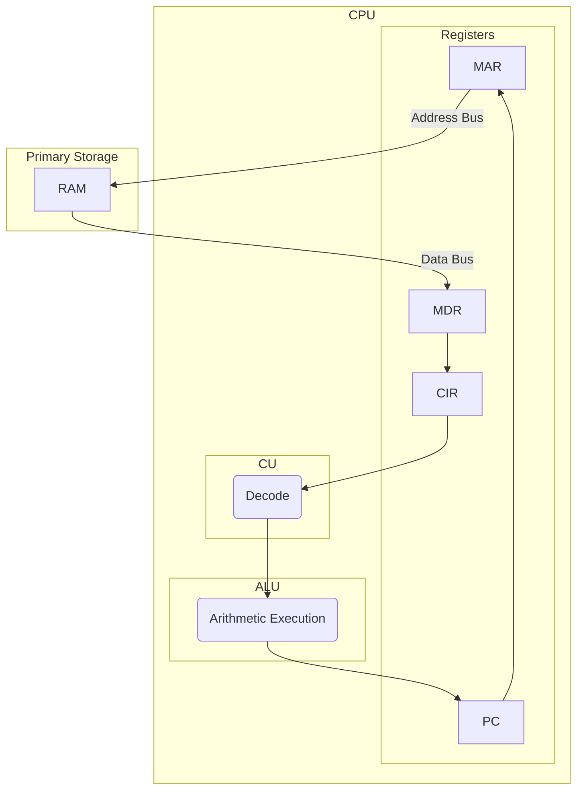

## 1.1 Hardware
### FDE Cycle

```mermaid
flowchart
	MAR--Address Bus-->RAM
	RAM--Data Bus-->MDR
	CIR-->dc
	dc-->exec
	exec-->PC
	subgraph Primary Storage
	   RAM
	end
	subgraph CPU
	    subgraph Registers
           PC-->MAR
           MDR-->CIR
	    end
		subgraph ALU
           exec(Arithmetic Execution)
		end
	    subgraph CU
           dc(Decode)
       end
	end
```

