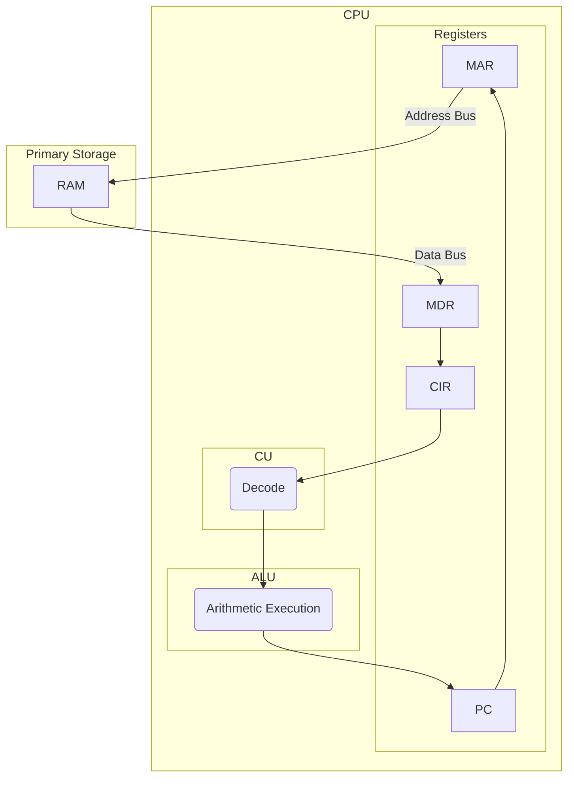
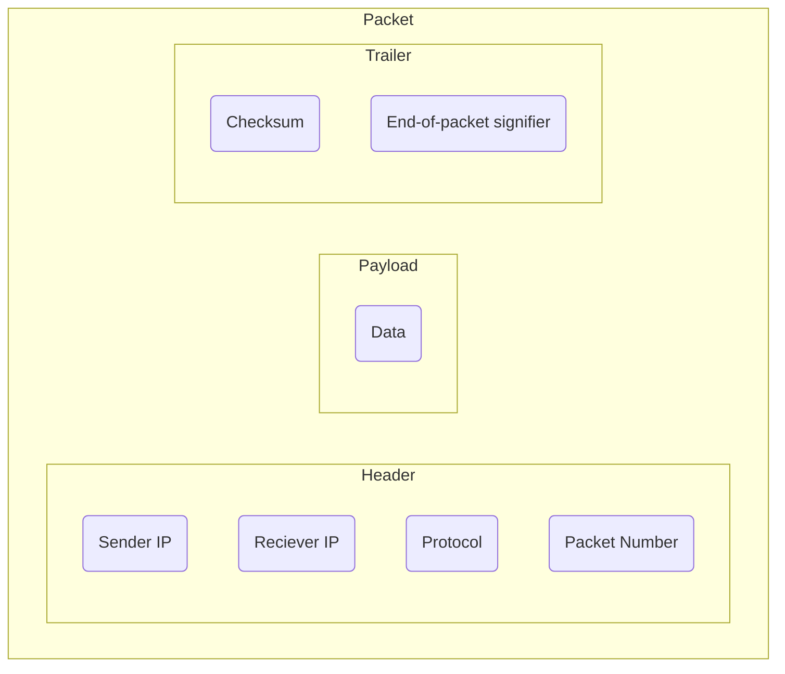

# Topic 1
## 1.1 Hardware
 - Input
   - Any device that can convert analogue information from people to digital information for computers.
   - Keyboards
   - Microphones
   - Webcams
   - Cameras
   - Scanners
 - Output
   - Any device that can take digital information and produce it in analogue, human-readable format.
   - Monitors
   - Speakers
   - Headphones
   - Printers
     - Laser – Uses lasers and magnetic toner, Inkjet – Uses jets of ink, Plotter – Uses maths and a physical pen
 - Storage
   - Secondary
     - SSD/HDD
     - Magnetic Tape
     - Optical
     - USB/MicroSD
   - Primary
     - RAM – Random access memory
     - ROM – Read only memory
     - Cache Memory, L1-3
 - Accessibility
   - Input
     - Braille keyboard
     - Puff-Suck switch
     - Trackball
   - Output
     - Braille display
     - Screen-readers
     - Voice Recognition
       - Voice Recognition 	– Commands
       - Voice Dictation	– Typing
       - Voice Print		– Authentication
 - Touchscreens
   - Resistive		– Uses a softer, flexible sheet of plastic to physically force electrodes to touch
   - Infrared		– Uses blocked beams of IR to detect when and where it was touched
   - Capacitive		– Uses the natural electric current in the human body to detect touch.

## 1.2 Von-Neumann Architecture
The von Neumann architecture—also known as the von Neumann model or Princeton architecture—is a computer architecture based on a 1945 description by John von Neumann. It consists of the following:
> [!tip]- Main Memory
> RAM – Random access memory, volatile, read/write storage
> ROM – Read only memory, non-volatile, read only storage
> Data and instructions are held in the same space
> CPU – Central processing unit

> [!tip]- Data Busses
> Address Bus – One way, carries the address requested by components.
> Data Bus – Two way, carries data between processor and storage devices.
> Control Bus – Two way, commands, timing and I/O information.

> [!tip]- Registers
> Program Counter
> Current Instruction Register
> Accumulator
> Memory Address Register
> Memory Data Register

> [!tip]- Other Components
> Arithmetic Logic Unit
> Control Unit
> Cache Memory

Factors of a CPU
 - Cache Size – b
 - Clock Speed – hz
 - Core Count – (number)
 - Word Size – bits that can be processed simultaneously
 - Bus Size – bits that can be transferred together.

## 1.3 FDE Cycle

## 1.4 Internet and Networking
### Protocols
*Protocols provide an agreed set of rules to allow networked devices to communicate. Network protocols are important as programs where a programmer invents their own protocol would be unable to communicate with other programs.*

> [!tip]- Protocols Summary
> IMAP allows messages to be _transferred and downloaded_ between computer systems via the internet.
> SMTP allows messages to be _sent_ between computers
> TCP is the protocol that allows packets to be sent and received between computer systems
> HTTP is the protocol that transfers multimedia web pages over the Internet.
> DHCP Assigns a (dynamic) IP addresses to devices on a network.
> FTP is for the exchange of large files over the Internet/network
> UDP is sending datagrams across a network with very few error recovery services.

> [!tip] The Internet -- The Internet is a world-wide communications infrastructure. A network of networks.

# Topic 2
## Logical Operations

# Topic 3
## Data Transmission

> [!tip]- Types of Transmission
> Serial Transmission - Transmit one bit at a time (using one cable, long distance)
> Parallel Transmission - Transmit multiple bits at a time (using multiple cables, short distance)

> [!tip]- Multiplexing & Switching
> Multiplexing - The process of combining and transmitting multiple signals over a communications link at the same time as a single, complex signal.
> Switching - Directing a signal or data packet towards a specified hardware destination.

> [!tip]- Packets
> Data Packet - A formatted unit of data that is transmitted over a packet switching network.
> Protocol - [[#Topic 1##1.4 Internet and Networking]]
> Routing - THe method of selecting a path along which packets will travel.

> [!tip]- Transmission Nodes
> Simplex - One direction (A --> B)
> Half-Duplex - Both Directions, not at the same time (A --> B, B --> A)
> Full-Duplex - Both Directions, at the same time (A <--> B)

### OSI Layers
 - Physical Layer 	-- Connectivity Protocols e.g Bluetooth
 - Data-Link Layer	-- Relate IP addresses to MAC addresses of specific devices
 - Network Layer	-- Transfer of data following the IP protocol
 - Transport Layer	-- Transfer data using UDP and TCP
 - Session Layer	-- Follows node to node communications sessions
 - Presentation Layer	-- Makes data to be readable
 - Application Layer	-- Services including FTP, HTTP and SMTP

# Topic 4
## Data Representation

# Topic 5
## Data Structures

# Topic 6
## Organisation of Data

# Topic 7
## Database Systems

# Topic 8
## The Operating System

# Topic 9
## Algorithms and Programs

# Topic 10
## Principles of Programming

# Topic 11
## Systems Analysis

> [!tip] Key Terminology
> Feasibility - Is the project likely to be successful
> Investigation & Analysis -

# Topic 12
## Software Engineering

# Topic 13
## Program Construction

# Topic 14
## The need for different types of software and their attributes

### The Computer Misuse Act (1990)
> Dissalows access of computer systems without permission e.g guessing someone's password.

### CAD & CAM
> Computer aided design & manafacturing.

# Topic 15
## Practical programming

# Topic 16
## Data Security

# Topic 17
## External/Ethical Factors on computing 
