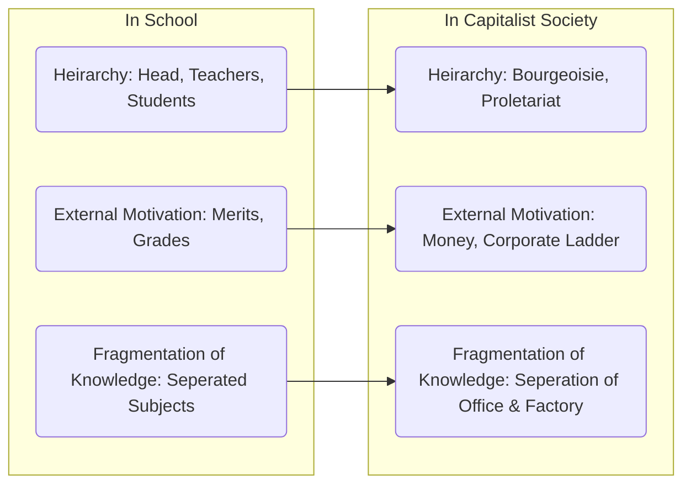
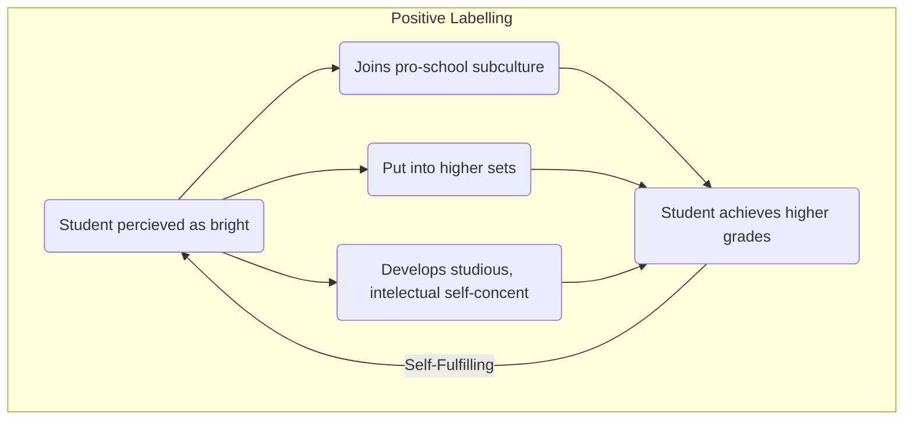
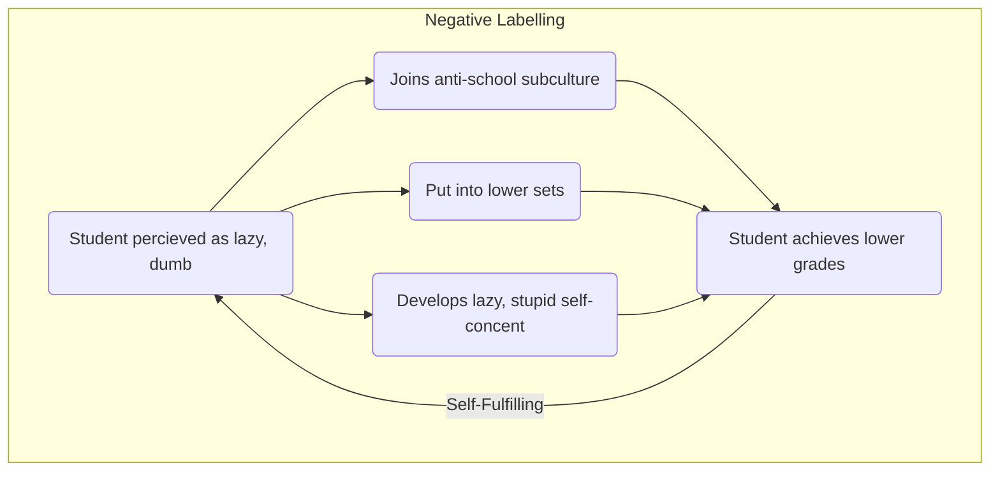

---
tags:
  - sociology
  - education
  - functionalism
  - interactionism
  - marxism
  - post-modernism
  - feminism
aliases:
  - sociology-education
---

# Sociological Theories
#marxism #functionalism #interactionism #post-modernism #feminism 

| Theory |Belief |
|--------|---------|
| [[Functionalism\|Functionalists]] | Believe everything has a **<u>function</u>**, and everything should remain as-is. \[*Typically conservatives, capitalists*\]|
| [[Marxism\|Marxists]] | Believe in Marx’s theories of value, economics and social class & society. \[*Typically progressivists, leftists*\]|
| [[Interactionism\|Interactionists]] | Micro-sociologists, focus on the inter-personal interactions and relationships between people e.g. student/teacher. |
| [[Feminism\|Feminists]] | (Typically 2nd+ Wave) Believe in the destruction and resistance against patriarchy, for a society equal to all genders.  |
| [[Post-Modernism\|Post-modernists]] | Focus on the belief that there is no objective reality, the struggles of living in the postmodern society |

# Functionalism
#functionalism 
## Durkheim
#functionalists
- Education is key in the socialisation process
- Norms, values and beliefs that are taught at home are reinforced in the school.
- Norms, values and beliefs that are undesirable will be negated.
- Education is key in social cohesion/solidarity -- being part of a community, something bigger than yourself, regardless of personal identity.

## The *Point* Of Education
- **Role Allocation**
	- People will <u>learn their place</u>, learn where they belong in society (e.g. good at programming --- become programmer)
	- #functionalists *Davis & Moore* theorised that education <u>sifts and sorts</u> people into their designated place in social hierarchy -- this links to the belief of meritocracy in functionalism
- **Social Cohesion**
	- People will feel *togetherness* and *solidarity*, through one shared goal of education
	- #functionalists see *Durkheim* above.
- **Skills for Work**
	- Self-explanatory, education is preparing children for work and employment.
	- #functionalists *Shultz* believes that by investing in school children, you will be investing into <u>human capital</u> which in turn will create a better economy for the future
- **Roles & Values**
	- Secondary agent of socialisation; it will teach the necessary norms and values to children
	- #functionalists *Talcott Parsons* believes in the <u>bridging effect</u>. School acts as a bridge between home and society and promotes universalistic norms and values and move away from particularistic values.
## Evaluation of Functionalist Perspective
#evaluation #ao3 #functionalism 
### Educating Yorkshire: Musharaf
#for-functionalism #qualitative

> Musharaf is a secondary school student with a stammer, he is almost entirely unable to talk until his teacher helps him. He is then able to stand up and give a presentation in front of his entire year.

> [!check]- Merticoracy
> Despite having incredibly different particularistic values, Musharaf is able to 'climb the ladder' and be just as good as the others.

> [!Check]- Solidarity
> Musharaf is applauded by his classmates, who understand and have solidarity with him.
### Cross National Comparisons 
#for-functionalism #quantitative 

> Formal education and qualifications are functionally advantageous for society as a whole, as they are correlated with a society’s level of economic development.

> [!check]- Human Capital
> By investing in the education system, countries are investing in their future economies.

> [!fail]- Correlation != Causation
> There could be many reasons for the correlation between formal education and economic development, for example it could be reverse (e.g. higher economic development can aid in the improvement of education)

### School Exclusion Statistics
#against-functionalism #quantitative 

> Exclusion statistics suggest that the education system is not perfect for *everyone*, with **5% receiving a fixed term exclusion** and **0.1% receiving a permanent exclusion**

> [!fail]- Demographic of Excluded Students
> - Boys are 3* more likely than girls to be excluded
> - FSM students are 4* more likely than non-FSM students
> - Black-Caribbean and mixed race students are 3* more likely

> [!fail]- Statistics May be Higher
> The study does not take into account 'informal exclusions' where schools convince parents to withdraw their children without making a formal exclusion order.

### Absenteeism
#against-functionalism #for-functionalism #quantitative 

> One in nine, or 11% of pupils are routinely absent from school, missing more than 10% of school in any one term.

> [!fail]- Demographic of Absenteeism
> As with exclusions, FSM students and boys are much more likely to be persistently absent than other demographics

> [!check]- Overall Absenteeism
> Statistics show that overall absenteeism (percent of school days missed by all students) is much lower, at only 6.13%

> [!fail]- Demographic of Overall Absenteeism
> Overall absenteeism is greatly affected by whether the school is a special educatory needs school or not, showing that once again there are demographics of people that funcionalists failed to consider.

### Work Prospects
#against-functionalism #for-functionalism #quantitative 

> Men who are or have been in higher education are payed 25% more than men who achieved A*-C GCSEs

> [!check]- Skills for Work
> This shows obvious correlation between work and education, therefore proving the "skills for work" theory

> [!fail]- Better Indicators
> Longitudinal studies have shown that those from more advantageous socio-economic backgrounds and those in private schools were much more likely to get the 'top-jobs' than others.

> [!faq]- Limitations of Initial Study
> The study only took into account men ([Malestream](Youth%20Culture.md)), and so does not consider the intersectionality of uneducated women. However, if this study had been more diverse, figures about the gender pay gap may have influenced the outcome of the study.

# Marxism
#marxism 

For a sample essay see [[Marxism Essay]]

Marxists propose that school teaches students to passively obey authority and reproduces and legitimises the class inequality in society. Education also works in favour of the ruling classes, due to [[Marxism#^culturalhegemony|Cultural Hegemony]]

There are three main functions of education according to Marxists:
- Keeps Status Quo
	- By reinforcing cultural hegemony and class inequality, the education system is giving working class students working class jobs. 
- Legitimises class inequality
	- By legitimising the myth of meritocracy, education is legitamising the idea that the working class have only themselves to blame for their financial circumstances.
- Works in the interests of the capitalist employers.
	- Obedient, passive and non-deviant students lead to obedient, passive and non-deviant workers.

>[!tip]- Bowles and Gintis
>Argue that the education system help to maintain capitalist systems by following the correspondence principal which explains the way in which the education system mirrors the world of wok. See [[#Correspondence Principle]]

>[!tip]- Althusser
>The education system is structured to engineer middle-class success and working-class failure. This is necessary to reproduce social inequality. The bourgeoisie influence the education system. 

## Correspondence Principle
#marxist Bowles & Gintis proposed that every segment of capitalist education corresponds to another segment of capitalist society

## Evaluation

# Interactionism
#interactionism 

Labelling theory, which is briefly discussed in [[Interactionism#Labelling]], makes up the majority of the work of interactionists on education
## Labelling Theory
Labelling theory holds that if a teacher labels a pupil a certain way they will accept or reject that label and the label will result in self-fulfilling prophecy.

## Key Studies

>[!pen]- David Hargreaves (1975)
> #interactionist Defined the process by which students are first speculated on, then elaborated on, before having their label stabilised.
> The process of speculation is often based on:
> - Appearance
> - Conformity
> - Enthusiasm
> - Likeability
> - Personality
> - Relationships

>[!pen]- Rist (1970)
> #interactionist found that new students were grouped into three tables, one for 'more able' and one for 'less able'. These judgements were not necessarily on ability.

> [!pen]- Jacobson (1968) (The Unethical Study™️)
> A random sample of 20% of the students were selected to be perceived as 'more able' based on a fake IQ test. These students, on average, made more progress than the students who weren't labelled.

# Feminism & Gender
#feminism 

## Gender and External Influences
*External Influences are influences **outside the purview** of the education system*

> [!tip]- Feminism
> More female role models targeted towards education in wider society has had a significant influence on education
> Feminism has caused women to aspire more toward education. *Sharpe, 1976, 1994*

> [!tip]- Employment

# Social Class
## Internal Factors

## External Factors
### Material Deprevation
> Leonard Feinstein (2003) - Test scores at 22 months could predict educational attainment at 26 years. High attaining poor children were overtaken by low attaining rich children.

 
