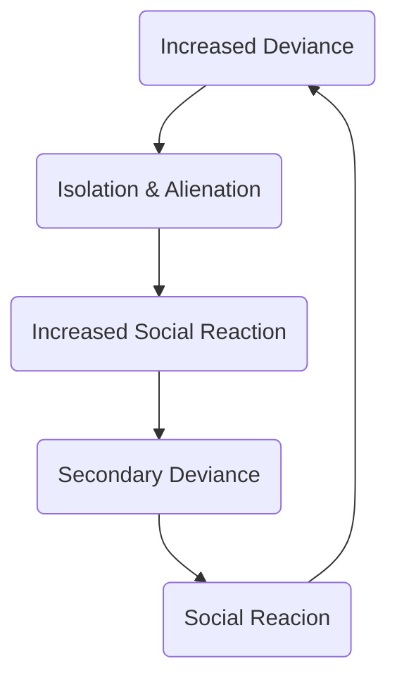
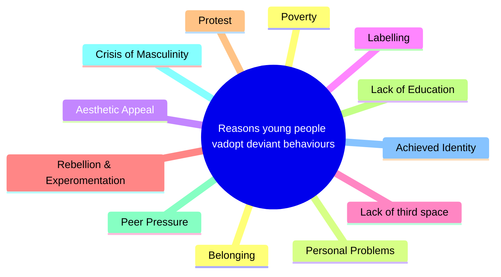

---
tags:
  - feminism
  - subcultures
  - youth
aliases:
  - subculture
  - youth-subculture
---
## What is Youth
A period of life somewhere between childhood and adulthood. The law in the UK means there is no clear-cut age for adulthood. Infantilism is the treatment of older or more mature people as younger or less mature based on their age. It is important to note that the legal age of youth will be different from the real age [[Youth Culture#^social-construct|see social constructs]].

## Magical Solution
Mike Brake suggests that many youth cultures were finding solutions to changing their situations, but these solutions were *magical*, as they didn't actually solve anything. The idea that youth will drift from their subculture despite thinking they never will.
## Factors of Youth Culture
#feminism #marxism #cccs

> [!faq]- Social Construct
> #vocab Social constructs are ideas that are given meaning by people within a society. In this way, youth is a social construct ^social-construct

> [!tip]- Origins of Youth Culture
> Youth cultures are a distinctive phenomenon that developed after the end of the Second World War. Higher **disposable income** for young people led to a move from **ascribes to achieved identity**
  
> [!tip]- Characteristics of Youth Culture
> - Age
> - Norms and Values
> - Fashion
> - Language
> - Music
> - Philosophy

> [!cite]- Phil Cohen (1972)
> #marxist Some youth cultures have significance to their cultural tastes and social meaning whereas other youth cultures were only about style and looks

> [!cite]- Bennett
> #sociologists Many people in youth cultures will retain their love of the music and styles well into their thirties.  

### Why did youth cultures develop
#economy #media

> [!tip]- Consumerism
> Due to the post-war economic boom, many people had an increased interest in consumerism, causing increased purchasing of identity-based products.

> [!tip]- Media
> Mass media became more readily available to young people -- magazines on femininity such as Cosmogirls and Shout ( #feminist McRobbie, 1996 )

> [!tip]- Multiculturalism
> People become more aware of other cultures and so adapted their styles into their own youth culture

> [!tip]- Baby Boom
> More young people in the population leads to more youth cultures.

> [!tip]- Moral Panic
> Moral panics about young people being deviant led to young people *feeling* different and so created their own norms and values

## Youth Subcultures
#subcultures #vocab #sociologists

| Group          | When      | Style                                 | Who                     | Studied By     | Other                                 |
| -------------- | --------- | ------------------------------------- | ----------------------- | -------------- | ------------------------------------- |
| Teddy Boys     | 50s-60s   | Smart Dress, Tailored Suits           | Working Class Boys      | Tony Jefferson | 1st prominent post-war youth culture. |
| The Mods       | Early 60s | Tailored Clothing, ex-military parkas | Working Class Men       | Stan Cohen     | Vespas                                |
| The Rockers    | 50s-60s   | Leather jackets                       | Working Class Men       | Stan Cohen     | Motorbikes                                      |
| The Skin Heads | 70s-80s   | Shaved heads, Combat boots            | Working class white men | Phil Cohen     | Sect of neo-nazis                     |
| The Punks      | 76s-80s   | Mohawks, DIY (Bricolage)              | Lower Class white       | David Beer     | Anarchism, equality                   |
| The Goths      | 70s       | dyed hair, corsets, platforms         | Middle-class            | Paul Hodkinson | Spirituality, diversity               |
| The Hippies    | 60s       | Flowery dresses, flowing clothes      | Middle class            | Stuart Hall    | Sex-liberation, anti-establishment    |
| New Romantics  | 80s       | Nostalgic, flamboyant, androgynous    | White, higher classes   | Blackman               | Defied gender expectations            |
| Hip Hop        | Late 70s  | Bomber jackets, tracksuits            | Lower class black men   | Tricia Rose    | Self expression, gang culture, ACAB   |
| Rave           | Late 80s  | Glowsticks, neon lights, comfort      | Everybody               | Sarah Thornton | Music, EDM, LSD, Shrooms              |
| Emos           | 2010s     | Emo bob, black hair, skinny jeans     | White people            | Andy Greenwald | Emotionally hardcore                  |

### 'Spectacular' Subcultures
#sociologists #functionalists 
*Cohen and Young* (1981) used the term 'spectacular' to describe a range of youth subcultures notable for their high social visibility.

## Gender & Subcultures
#ao3 #feminism #media #economy 

>[!cite]- McRobbie & Garber
> #feminist  Girls were involved -- you can see them in the photos of old film footage of the early 50's and 60's, however they were ignored due to the 'invisible girl' phenomenon. 
> > [!tip]- Malestream
> > Male sociologists were also the majority and so resulted in ***malestream***, where male sociologists study males leading to biases. McRobbie and Garber criticised their colleagues at the #cccs for conforming to this. 
> ---
> >
> ---
> > [!tip]- Bedroom Culture
> > Staying in the bedroom was safe for girls, and so they participated in youth culture within the bedroom. Teenyboppers are an example of this
> ---
> > 
> ---
> > [!tip]- Sexual Resistance
> > The raga girls were sexually deviant and a youth subculture, but were not studied, another example of malestream. McRobbie and Garber studied them, proving their existence and showed that subcultures could be resistance to patriarchy.
### Ladettes
Ladettes were a subculture formed around *girls acting masculine*. This shows youth subcultures being used in a way to promote resistance to patriarchy.
### Bottom Drawer
Girls were *unable* to participate in youth subcultures as a large reason for the rise of youth subcultures was the increase in disposable income -- something which girls did not have. Even when they did have disposable income, they had to save for their **bottom drawer**, saving household commodities for their future husbands.
### Media
The media focused on the sensational aspects of youth subcultures -- something which girls could not participate in as it may have been seen as being *unfeminine* or *not ladylike*
### Reputation
Girls had to **protect** their reputation and therefore couldn't participate in subcultures otherwise they would be seen as sluts.

#sociologists #feminist 

>[!cite]- Christine Griffin
> Also cited for the invention of the term invisible girl, argued that it cannot be assumed that boys and girls experience youth the same

>[!cite]- Blackman
> Studied new wave girls and found that this was a way that girls could resist against patriarchy in a society that does not expect girls to behave in this way
## Social Class & Youth Culture

 >[!tldr]- Subcultures and the Working Class
 >The skinheads were a working class response to the lack of working class community - they created their own community
 >The teddy boys were almost satirical in their nature - through the user of upper class Edwardian dress working class people could 'pose' as upper classes

### Magical Solution and the Working Class
[[#Magical Solution]] is often associated with the working class, as youth culture and furthermore subcultures can be seen as a (magical) method of escaping one's material conditions and striving for a more equitable future.

>[!quote]- Phil Cohen
> #marxist #sociologists #cccs 
>Phil Cohen and the CCCs suggests that youth (sub)cultures are a method of magically recreating the values and experiences of older geneations (see: skinheads)

>[!quote]- Hebidge
>Punk were a conscious rejection of consumerism through bricolage, nevertheless punk styles were defused by capitalism through a lens that is safe to consume

### Middle Class Youth
Examples of middle class youth rejecting the norms and values of mainstream society include:

> - Goths
> - Beetniks
> - Hippies

Often appear as those who are 'educated'.
 
## Ethnicity & Youth Culture

> [!tip]- Globalisation
> The process by which societies are becoming increasingly interconnected.

[[#Magical Solution]] is often associated with ethnic minorities, as youth culture and furthermore subcultures can be seen as a (magical) method of escaping one's material conditions (racism) and striving for a more equitable future.

---
## Neo Tribes
#neo-tribes #post-modernism 
Youth subcultures are no longer as populous or 'spectaculars', and people have adopted a 'pick-n-mix' attitude towards style and culture.

>[!quote]- Maffesoli, Bennet, Zygmunt Bauman
> #post-modernists #sociologists 
> A neo-tribe is a group of people who have chosen to come together for a particular period of time and place for a specific reason this term was then used by Bennett to describe modern youth cultures. Bennett rejects the view that class/social background shapes the behaviour of young people. Zygmunt Bauman concurred, arguing that the certitudes of life, such as class and gender have become less significant in an increasingly unstable and liquid world

>[!tip]- Temporal associations 
>Associations that only exist for a specific reason and period of time.

> [!tip]- Hybridity
> The merging of multiple cultural identities into one personal identity. This is paticularly seen within mixed-ethnicity subcultures such as the Brasian subculture
### Attributes of Neo Tribes
#ao2
- New
- Non-Committal
- Fashion/Style
- Hybrid
- Temporal
- Individuality
- Diversity

>[!quote]- Ted Polemus
> #post-modernists
> Used the term 'supermarket of style' to describe the way young people choose their different elements of style as if shopping around for the best looking style

#sociologists #post-modernists
> The term 'fast-fashion was coined by ***Muggletone***

>[!quote]- Hodkinson
>Hodkinson (The guy who looks like phil of dan and phil fame) (2002) states that for a substantial number of young people, membership of a youth culture is very significant, with people adopting a particular sub-cultural lifestyle, norms and values over long periods of times. Thronton (1995) and MacDonald (2001) have come to similar conclusion.

---
## Ordinary Youth
### Ignored in Sociology
Ordinary (Non-Subcultural/Conformist) Youth -- Ignored in Sociology Subcultural theorists have often ignored the ordinary majority of youth

> [!quote]- Pearson
> Pearson suggested that every generation has a view of young people behaving better in their day. He called this the "Golden Age"

>In today's society youth is more conformist; two thirds of youth are worried about their image in relation to job prospects (BBC, 2015)

>[!quote]- Bo Reimer
> Bo Reimer argues that personal choice and taste are becoming more important than structural beliefs Reimer also suggested that this cuts across class, gender and ethnic boundaries

>[!quote]- Hebdige 
>Hebidge argues that technology has created proto culture
### Demonised Youth Cultures
so basically the BENEFIT SCROUNGERS 👹

> [!tip]- Neets
> Not in education, employment or training
> More likely to remain benefit dependent throughout their lives
> Shildrick and RUddy argued that focussing on NETs as a problem overlooks the nature of the work available to young people (0-hour contracts etc.)

> [!tip]- Teenage mums
> Commonly held but mainly mythical belief of obtaining a council-house through teen pregnancy
> Conservative Party proposed that housing for teenage mothers should be cut.
> Fiona Weir pointed to this being a stereotype and incorrect; teen pregnancy is falling and only 2% of single parents are teenagers.

> [!tip]- Gangs
> The association between youth and crime is long standing and there is some basis in fact.
> More likely to be convicted of a crime than older people.
> 22% of serious violence and nearly half of all shoaotings in London attributed to gang violence.
> London has the lowest murder rate in over 30 years.

> [!tip]- Mental Health
> Number of medical and social studies suggest that young people have more mental health problems
> Higher levels of self-harm and anxiety
> Charles Murray suggest that the problem is poor parenting2

---

## Pupil Subcultures

> A group of pupils who share similar values and behaviour patterns
### Impact of Subcultures in Schools
 - Inequalities
 - Class differences
 - Achievement differences
 - Self-fulfilling prophecy

> [!quote]- Colin Lacey _(1970)_
> Differentiation -- Process by which teachers categorise pupils according to how they percieve their ability, attitude and/or behaviour.
#### How?
 - Setting / Streaming

> **Polarisiation** -- Pupils respond to streaming by moving towards one of two opposite poles or extremes.
#### Hightown boys grammar school study
Streamed & polarised boys into a pro and anti school subculture

|Pro|Anti|
|--|--|
|High Streamed|Low Streamed|
|Middle Class| Working Class|
|High Status| Failure|
|Committed to school values|Low self esteem|
||Formed to gain status|
||Sabotage the system|

# List of Relevant Studies
 - Willis (1977) - Learning to Labour (the lads who are "having a laff")
 - Hargreaves (1967) & Lacey (1970) - No shared norms or values (apposed functionalism)
 - Sewell (2000) - Studied african-carribean subcultures (Openly racist schools, threatening to teachers, subcultures of african-carribbean children formed)
 - Safia Mirza (1992) - Identified girl cultures who were both racists and resisted racism
 - Mac an Ghail (1994) - Girls gain status, boys lose status, crisis of masculinity
 - Shain (2003) - Asian subcutlural girl groups resisted parents and racism
 - Carolyn Jackson (2006) - Ladettes
 - Emma Reynolds (2013) - Girls hypersexualise to look older not to be sexual
 - Williamson (1996)  - Most students are conformist
 - Urdd (2011) - Pro-welsh attitude

| Name | Norms/Values | Examples of pro behaviour | Examples of anti behaviour |
| ---- | ---- | ---- | ---- |
| Gang Girls | Anti-education, Confrontaitonal, Us/Them attitude, felt they experienced racism. |  | Confrontational attitude, survival attitude, white/male students/teachers exclusion |
| Faith girls | Pro-school, pro-faith, religious | Positive relationship with teachers |  |
# Youth & Deviance
## The Other
> Youth culture being portrayed negatively in mediadates back decades, however the first notable **moral panic** are the mods and rockers

### Sociologists for Youth & Deviance

> [!bi-arrows-angle-expand]- Collapsed
> > [!pen]- David Buckingham
> Recently children have become increasingly important consumers for media products and technologies
>  
> > [!pen]- Adorno
> Differences between consumer goods and products were largely artificial but packaging was changed in order to appeal to different people
> 
> > [!pen]- Kelner
> Over the last 20 years, young people have bought into identities and presented themselves into roles.
> 
> > [!pen]- Louise Archer
> The wealthier young people had a number of ways of expressing their privilege.
> 
> > [!pen]- Danah Boyd
> Young people may develop a street style and the media copies and markets towards this.
> 
> > [!pen]- Hassan and Katnis
> The growth of media technology is spurring the development of global youth market for forms of clothing and music.
> 
> > [!pen]- Sonia Livingstone
> As a result of technological change youth culture is qualitatively different in contemporary society because young people are able to develop global youth cultures (globalisation)
> 
> > [!pen]- Morley
> Technology is shaping youth's lives everyday, making them different from their parents.
> 
> > [!pen]- Beck
> Modern societies perceive, assess, and manage risks. Beck argues that in the modern world, risk has become a central aspect of our lives, and that we are constantly bombarded with warnings and threats of various kinds
> 
> > [!pen]- Livingstone (2002)
> Explores the impact of technology on the privacy and personal space of children and teenagers in the home. Livingstone argues that with the advent of new technologies such as the internet, mobile phones, and television, the boundaries between public and private spaces have become increasingly blurred, particularly in the bedroom.
## Pupil Subcultures
> Pupil subcultures are groups of students who share some values, norms and behavious, which give them a sense of identity and provide them with status through peer-group affirmation

### Pro School Subcultures
*The following were defined by Mac An Ghail in 1994*

>[!tip]- Academic Achievers
>Students of working-class backgrounds, who focus on traditional academic subjects such as mathematics, English, and the sciences to gain academic success.

> [!tip]- The New Enterprisers
Students of working-class backgrounds, who deny the usefulness of traditional academic subjects but aspire to do well in the alternative, more ‘practical’ subjects, such as business and computing.

### Anti-School Subcultures

 > [!tip]- Paul Willis' Lads
In *Learning to Labour* (1977), Paul Willis studied a group of 12 working class white boys who showed an active defience towards authority and their teachers; Willis argues that these boys were actively recognising the systems that were working against them in school and chose to defy them.

> [!tip]- Tony Sewell
Tony Sewell noted that black carribean boys will often feel a pressure to be in an anti-school subculture due to pressure to join a 'street' style from peers.

> [!tip]- Fordham & Ogbu
Found that ‘acting Black’ was set in opposition to ‘acting White’ and since acting White also included trying to achieve academic success, acting Black seemed to include not doing well in education.

> [!tip]- Mac an Ghail
He found that the African-Caribbean students were subjected to institutional racism, to which they reacted with anti-school attitudes and behaviour.

## Moral Panics
A moral panic occurs when the media exaggerates certain deviant behaviours in order to garner more attention, but in doing so cause social outrage against a deviant group.
> Leslie Wilkins first showed the Deviance amplification spiral, looking like the following. 

## Reasons why young people adopt deviant behaviour

## Youth Gangs
### Characteristics
 - Territory
 - Loyalty
   - Rites of passage - they have to pass a test to join the gang
 - Heirarchy
   - Venkatesh's Gang Leader for a Day
 - Delinquent Subculture
   - Gangs have different norms and values to wider society
 - Family & Belonging
   - Integration & concensus within the community, protection
 - Shared norms and values
   - Some gangs are not particularlly criminal (Milltown Boys, 1997)

### Causes
> [!tip]- Croward and Onlin (1960)
> Identified three different types of criminal youth gangs:
> Crime-oriented gangs, influenved by adult proffesional criminals
> Conflict-oreinted gangs - status frustration, causes people to get status through gangs
> Retreatist - Contempt for mainstream society -- magical solution

> [!tip]- Hirschi (1969)
> Pointed out most delinquent boys become law abiding citizens in adulthood.

> [!tip]- Shay and McKay (1969)
> More crime in cities -- concentrated areas of poverty & deprevation (status frustration).
> Social disogranisation and local norms value crime -- underclass (Murray)

> [!tip] Miller (1958)
> Focal concerns were 'staying out of trouble', crime caused norms and values held by young men (Malestream view)
> Teddyboys valued being witty and aggressive
> Thrillseeking (edgework)
> Need for control (class frustration)

### Studies in the United Kingdom

> [!tip]- Howard Parker (1974)
> A View from the Bots describe a culture in Liverpool where boys are not looking for trouble, but won't back away from it

> [!tip]- Willmott (1966)
> Adolescent boys in East London found young men in boring jobs who use deviance to get some excitement in life (edgework)

> [!tip]- Home Office Report (2008)
> Suggested that youth gangs were linked to problems of urban violence and rising rates of weapon use.

> [!tip]- Modern UK Studies
> Masculine identity - Many researchers view the existnce of gangs and aggresivley deviant youth culture as linked to the crisis of masculinity
> Education failure - Pitts (2008) suggests that young men find respect in gangs and in street culture (status frustration)
> Style and resistance - Echoes CCCS which suggests that gang related activity resis at times ofe conomic stress. (skinheads) BUT AO3 EMA & FSM & Scholarships allow lower privellege children to counterract economic pressure.

